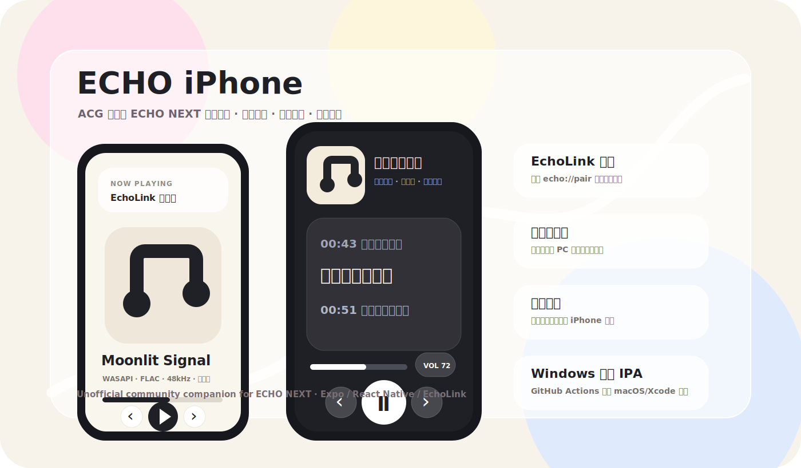

<p align="center">
  
</p>

<h1 align="center">ECHO iPhone</h1>

<p align="center">
  An unofficial iPhone companion for <a href="https://github.com/Moekotori/ECHO">ECHO NEXT</a>.
</p>

<p align="center">
  <strong>English</strong> · <a href="README.md">中文</a> · <a href="RELEASE_NOTES.md">Release Notes</a>
</p>



> This is an unofficial community project and is not maintained by the official ECHO NEXT project.

## What It Is

ECHO iPhone turns an iPhone into a lightweight music-player client for the ECHO NEXT desktop app. It connects through EchoLink, browses the PC library, controls playback, shows live status, and can stream supported tracks to the phone.

This release focuses on a full UI refresh: the playback page is denser and more polished, the lyrics view now feels like a proper reading screen, and the dock uses a unified glass style.

## Highlights

- EchoLink pairing URI support and manual LAN connection.
- Three pages: Playback, Library, and Connection.
- Swipe navigation plus a redesigned bottom dock.
- Full-screen playback layout with denser controls.
- Glassmorphism controls powered by `expo-blur`.
- Lyrics mode with large text, auto-scroll, and active-line highlighting.
- Tap-to-seek for timestamped lyrics.
- Stable artwork loading that avoids flicker.
- Drag progress and volume controls with gesture lock to prevent interruptions.
- Previous, play/pause, next, repeat-one, and queue preview.
- Library search and PC playback entry.
- Artwork loading with fallback behavior.
- Control / stream output switch.
- Metadata tags when EchoLink provides them.

## Requirements

- Node.js and npm
- Expo via `npx expo`
- macOS + Xcode for local iOS builds
- GitHub Actions for unsigned IPA generation on Windows
- A signing/install method such as Sideloadly or AltStore for device testing

## Run Locally

```powershell
npm install
npm run start
```

Type check:

```powershell
npm run typecheck
```

iOS export check:

```powershell
npx expo export --platform ios --output-dir build\export-check
```

## Connect to ECHO NEXT

Pairing URI example:

```text
echo://pair?host=192.168.1.12&port=26789&token=...
```

Manual fields:

- Host: PC LAN IP
- Port: usually `26789`
- Token: copied from the desktop EchoLink pairing screen

If connection fails, check LAN, firewall, EchoLink status, host IP, and iOS local network permission.

## Build Unsigned IPA

Windows can trigger the workflow, but actual iOS packaging requires macOS/Xcode.

1. Push the repo to GitHub.
2. Run `Build iOS unsigned IPA` in GitHub Actions.
3. Download the `ECHO-iPhone-unsigned-ipa` artifact.
4. Sign/install it with Sideloadly, AltStore, Xcode, or another tool.

Local Mac:

```bash
bash scripts/build-unsigned-ipa-for-sideloadly.sh
```

## Release Notes

See [RELEASE_NOTES.md](RELEASE_NOTES.md).
